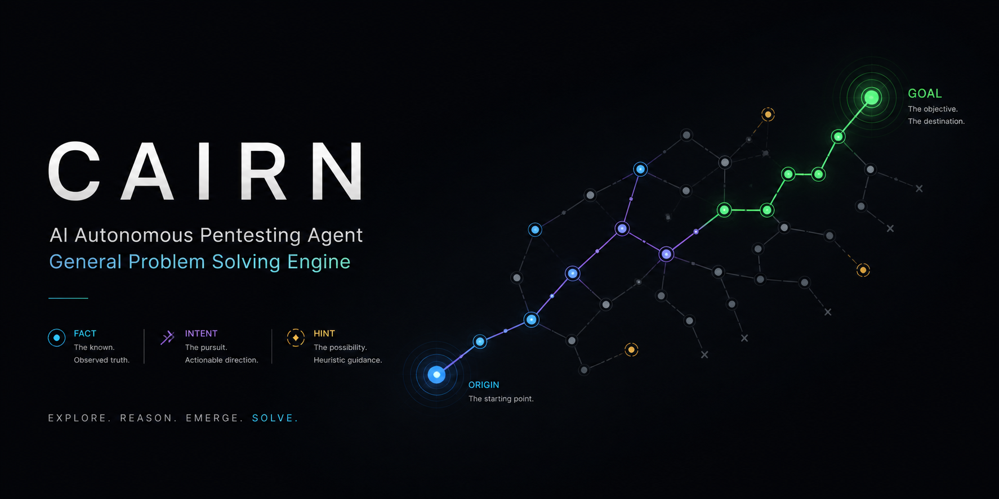
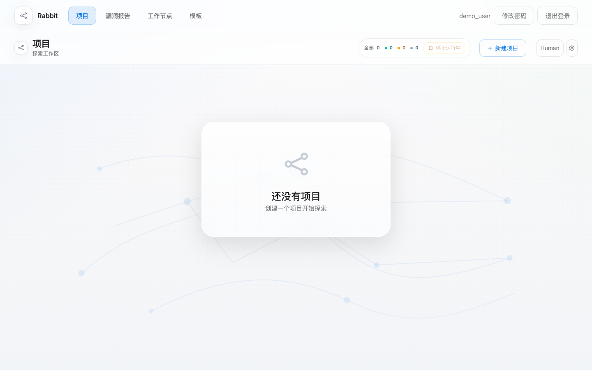
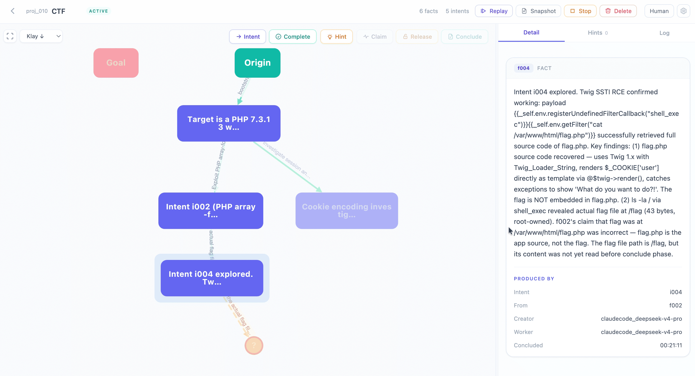
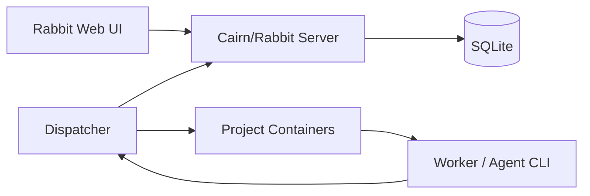

# Rabbit



Rabbit 是一个面向智能渗透测试与协作探索的产品化平台。项目基于事实图协议组织探索过程：从 `Origin` 出发，多个 Worker/Agent 围绕同一张图声明 `Intent`、写回 `Fact`、补充 `Hint`，直到目标 `Goal` 被证明完成。

本仓库在 [oritera/Cairn](https://github.com/oritera/Cairn) 的事实图协作探索思想和基础工程之上继续开发，补充了更完整的 Web 产品界面、账号体系、漏洞报告、Worker 监控、模板和时间线等能力。

## 截图

### 登录与会话


### 工作台



### 事实图探索视图



## 核心能力

- 事实图探索：用 `Project / Fact / Intent / Hint` 表达问题起点、目标、探索动作和辅助提示。
- 多 Agent 调度：Dispatcher 负责选择 Worker、维护任务心跳、处理超时、把结构化结果写回 Server。
- 项目生命周期：支持 active、stopped、completed、reopen 等状态，停止项目会阻断新任务并取消本地运行中的探索。
- 用户认证：支持注册、登录、登出、改密、服务端 Session、HTTP-only Cookie 与登录失败限流。
- 漏洞报告：从项目事实中聚合安全发现，按 Critical、High、Medium、Low 等级分类，并支持过滤与导出。
- Worker 工作台：展示 Worker 类型、状态、任务历史、心跳和执行指标。
- 项目模板：内置 Web 应用评估、内网渗透、外网渗透、CTF 挑战等模板，也支持自定义模板。
- 攻击时间线：按时间顺序展示事实发现、意图声明、意图结论和项目完成过程。
- Web UI：单页应用，包含项目、漏洞报告、工作节点、模板、图谱详情、提示和日志面板。

## 架构概览



### Server

Server 是协议真相源，负责保存项目、事实、意图、提示、模板、漏洞和用户 Session，并提供 FastAPI 接口与静态前端页面。

### Dispatcher

Dispatcher 是执行控制面。它读取项目图，选择任务类型，调度 Worker，在项目容器内启动 Agent，并把 Agent 输出解析为结构化事实或状态变更。

### Worker / Agent

Worker 不直接写协议接口，而是接受 Dispatcher 渲染后的任务 Prompt，完成 `bootstrap`、`reason` 或 `explore` 任务后返回 JSON，由 Dispatcher 负责写回。

## 快速启动

### 本地开发

```bash
cd cairn
uv sync
uv run cairn serve --host 127.0.0.1 --port 8765 --log-level info
```

访问：

```text
http://127.0.0.1:8765/
```

默认 SQLite 数据库位置：

```text
~/.local/share/cairn/cairn.db
```

### Docker Compose

```bash
docker compose up --build
```

Compose 会启动：

- `cairn-server`：Web/API 服务，默认映射到 `8000`
- `cairn-dispatcher`：调度器，读取 `dispatch.yaml`

数据默认挂载到：

```text
./datas/cairn/
```

## Dispatcher 配置

调度配置位于根目录：

```text
dispatch.yaml
dispatch_mock.yaml
```

常用字段：

- `server`：Server 地址
- `runtime.interval`：调度循环间隔
- `runtime.max_workers`：全局最大并发
- `runtime.max_running_projects`：同时运行的项目数
- `container.image`：项目容器镜像
- `workers[]`：Worker 名称、类型、任务类型、并发和环境变量

生产使用前请把 `dispatch.yaml` 里的模型密钥、服务地址和 Token 替换为自己的配置，不要把真实密钥提交到公开仓库。

## 目录结构

```text
.
├── cairn/                  # Python 包：Server、Dispatcher、静态前端与测试
│   ├── src/cairn/server/   # FastAPI 服务、路由、认证、数据模型
│   ├── src/cairn/dispatcher/ # 调度器、Worker 适配、任务执行链路
│   └── tests/              # 后端单元测试
├── container/              # Worker 容器构建文件
├── docs/specs/             # 协议和调度设计文档
├── README/                 # README 图片资源
├── dispatch.yaml           # 真实调度配置示例
├── dispatch_mock.yaml      # Mock Worker 调度配置
└── docker-compose.yaml     # Server + Dispatcher 编排
```

## 测试

```bash
cd cairn
uv run python -m pytest
```

当前代码里模板标题已中文化，如果本地测试仍保留旧英文断言，`tests/test_templates_router.py` 可能会出现预期标题与实际中文标题不一致的失败。

## 设计文档

- [服务端协议](docs/specs/server-protocol.md)
- [Dispatcher 设计](docs/specs/dispatcher-design.md)
- [产品化 UI 需求](.kiro/specs/cairn-product-ui/requirements.md)

## 致谢

感谢 [oritera/Cairn](https://github.com/oritera/Cairn) 提供的协议思想与基础工程。Rabbit 的事实图探索模型、协作式 Agent 工作流和 Server/Dispatcher 分层都受 Cairn 启发，并在此基础上继续做产品化扩展。

## License

本项目遵循仓库中的 [AGPL-3.0 license](LICENSE)。
