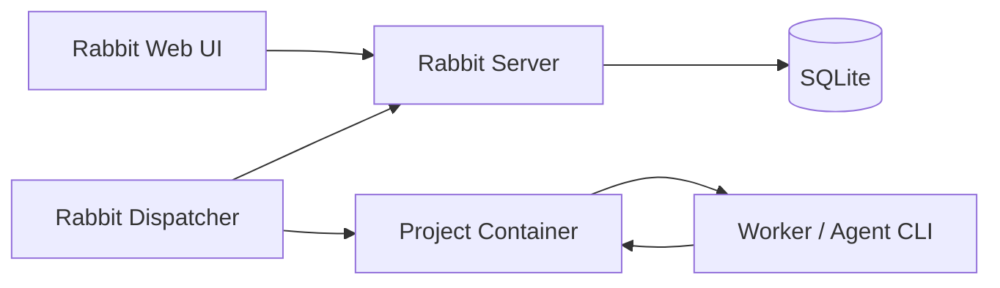

# Rabbit


Rabbit 是一个面向智能渗透测试的事实图协作平台。它把一次测试任务拆成可追溯的探索图：人和 Agent 共享同一个工作面，从起点事实出发，声明探索方向，写回确认事实，持续收敛到目标证明和漏洞报告。

这个项目不是简单换皮。Rabbit 在事实图协议、调度器、Web 产品界面和安全测试工作流上做了自己的实现与扩展；对上游灵感来源的说明放在文末“致谢”，正文统一使用 Rabbit 的产品语义。

## 产品预览

### 登录页


### 项目工作台


## Rabbit 解决什么问题

传统自动化扫描很容易得到一堆离散结果，但难以回答三个问题：

- 这个结论从哪里来？
- 下一步为什么要这么做？
- 最后报告里的漏洞证据链是否可复盘？

Rabbit 用事实图把这些过程显式记录下来：

- `Origin`：项目起点，例如目标范围、入口地址、初始约束。
- `Goal`：项目目标，例如拿到 flag、确认入口风险、完成某类评估。
- `Fact`：已经确认的事实，只追加，不覆盖历史。
- `Intent`：从一个或多个事实出发的探索动作。
- `Hint`：人工或系统补充的策略提示，不直接进入事实链。

这样，Agent 的每一步动作都有上下文，人的每一次介入也能落在同一个工作面上。

## 核心功能

- 项目管理：创建、停止、恢复、完成、重开和删除项目。
- 事实图视图：以图谱方式展示 Origin、Goal、Fact、Intent 和它们之间的因果关系。
- 人机协作：人可以补充 Hint、创建 Intent、查看 Agent 产出的事实。
- Agent 调度：Dispatcher 负责把项目状态转成 `bootstrap`、`reason`、`explore` 三类任务。
- Worker 管理：查看 Worker 状态、任务历史、心跳和执行指标。
- 漏洞报告：从项目事实中提取漏洞，按严重级别聚合、过滤和导出。
- 项目模板：内置 Web、内网、外网、CTF 等常见任务模板，支持保存自定义模板。
- 攻击时间线：按时间顺序复盘事实发现、意图结论和项目完成过程。
- 账号体系：支持注册、登录、退出、改密、服务端 Session 和登录失败限流。

## 架构



Rabbit 由四部分组成：

- Web UI：项目操作、图谱查看、漏洞报告、Worker 面板和模板管理。
- Server：FastAPI 服务，负责协议接口、认证、数据存储和静态页面。
- Dispatcher：调度控制面，负责选择 Worker、维持心跳、处理超时和写回结果。
- Project Container：每个项目独立的执行环境，承载安全测试工具和 Agent CLI。

## 快速启动

### 本地运行

```bash
cd cairn
uv sync
uv run cairn serve --host 127.0.0.1 --port 8765 --log-level info
```

打开：

```text
http://127.0.0.1:8765/
```

说明：当前 Python 包和 CLI 仍保留 `cairn` 目录/命令名，这是为了兼容现有工程结构；产品和文档层面使用 Rabbit。

默认数据库：

```text
~/.local/share/cairn/cairn.db
```

### Docker Compose

```bash
docker compose up --build
```

Compose 会启动 Rabbit Web/API 服务和 Rabbit 调度器。服务名仍沿用当前工程里的 compose 配置，后续如果重命名工程包，可以再统一调整。

数据目录：

```text
./datas/cairn/
```

## Dispatcher 配置

调度配置在仓库根目录：

```text
dispatch.yaml
dispatch_mock.yaml
```

关键字段：

- `server`：Rabbit Server 地址。
- `runtime.interval`：调度循环间隔。
- `runtime.max_workers`：全局 Worker 并发上限。
- `runtime.max_running_projects`：同时运行的项目数。
- `runtime.max_project_workers`：单项目 Worker 并发上限。
- `container.image`：项目运行容器镜像。
- `workers[]`：Worker 名称、类型、任务范围、优先级和环境变量。

公开仓库前请检查 `dispatch.yaml`，不要提交真实 API Key、Token 或内部服务地址。

## 目录结构

```text
.
├── cairn/                    # Rabbit 的 Python 工程目录
│   ├── src/cairn/server/     # Server、路由、认证、模型和静态前端
│   ├── src/cairn/dispatcher/ # 调度器、任务模型和 Worker 适配
│   └── tests/                # 后端测试
├── container/                # 项目执行容器
├── docs/specs/               # Rabbit 协议和调度文档
├── README/                   # README 图片资源
├── dispatch.yaml             # 调度配置示例
├── dispatch_mock.yaml        # Mock Worker 配置
└── docker-compose.yaml       # Server + Dispatcher 编排
```

## 测试

```bash
cd cairn
uv run python -m pytest
```

如果本地测试仍保留旧英文模板标题断言，而代码返回中文模板标题，`tests/test_templates_router.py` 会出现标题预期不一致的失败。

## 文档

- [Rabbit 协作探索协议](docs/specs/server-protocol.md)
- [Rabbit Dispatcher 设计](docs/specs/dispatcher-design.md)

## 致谢

Rabbit 的事实图协作思路受到 [oritera/Cairn](https://github.com/oritera/Cairn) 启发。感谢原项目对 Fact / Intent / Hint 协作探索模型和 Agent 工作流方向的开源贡献。

本仓库在此基础上继续做 Rabbit 自己的产品化实现，包括 Web 体验、认证体系、漏洞报告、Worker 工作台、模板、时间线和本地化安全测试流程。

## License

本项目遵循仓库中的 [AGPL-3.0 license](LICENSE)。
