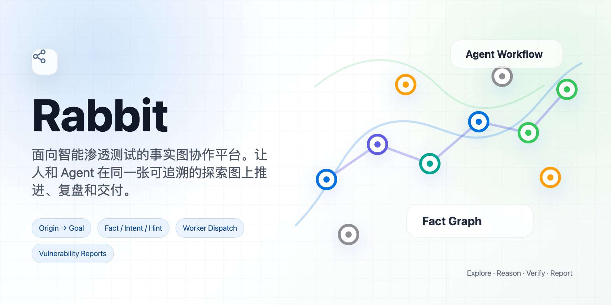
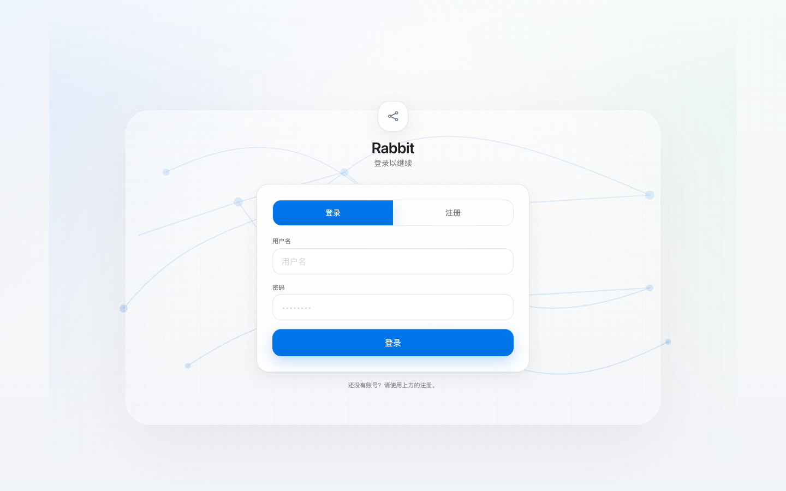
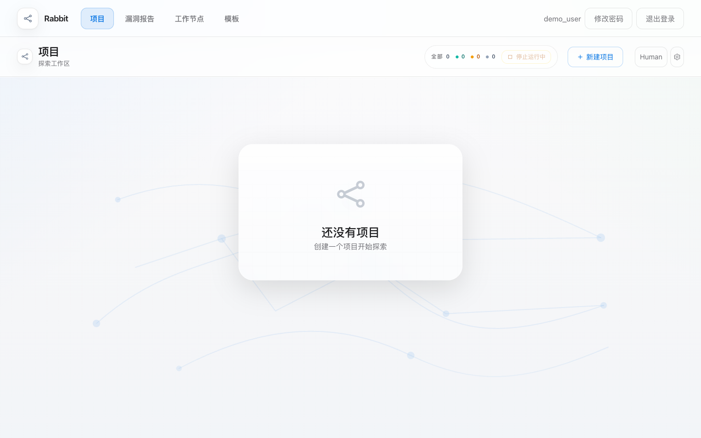
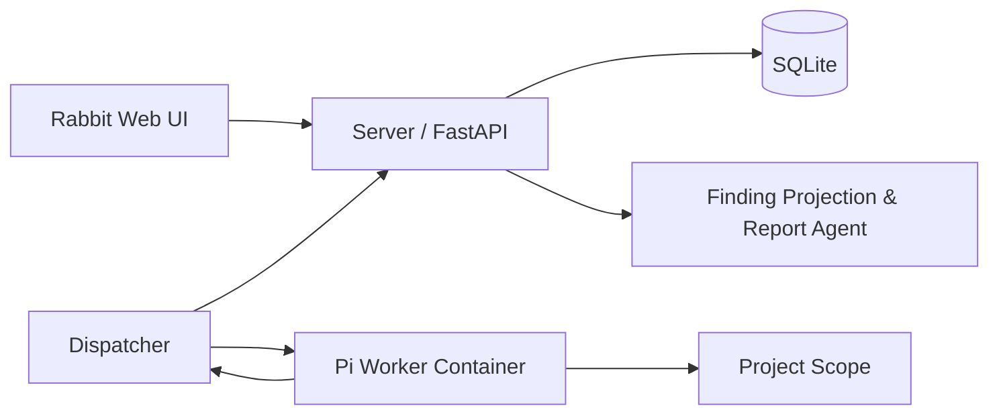

# Rabbit（Cairn-Y）



Rabbit 是基于 [oritera/Cairn](https://github.com/oritera/Cairn) 演进而来的 Cairn-Y 实现。它保留 Cairn 的事实图与 Worker 协作核心，但把运行模型收敛为一条可验证的闭环：**Server 保存唯一状态，Dispatcher 负责调度，Pi Worker 负责 Decide / Execute，所有执行结果最终写回 Fact，可确认的问题以 Finding 作为唯一真相源。**

项目目录和 Python CLI 继续使用 `cairn` 名称，以兼容原工程结构；产品界面使用 Rabbit。

## 预览

### 登录与注册



### 项目工作台



## Cairn-Y 核心模型

```text
Origin
  └─ Goal
      └─ Decide（串行决策，只创建/调整 Step）
          └─ Step
              └─ Execute（并行执行）
                  ├─ Fact
                  └─ Finding（可选，必须关联 Fact）
```

- **Server**：唯一状态真相源，维护 Project、Goal、Step、Fact 和 Finding。
- **Dispatcher**：负责项目生命周期、串行 Decide、并行 Execute、Worker 调度、租约、心跳和超时。
- **Pi Worker**：通用执行单元；当前运行配置只注册 Pi，不保留第二套执行内核。
- **Fact**：执行阶段确认的客观结果；Step 无论成功、失败还是未发现问题，最终都收敛为 Fact。
- **Finding**：Execute 原生输出的结构化发现，是报告系统唯一允许使用的发现来源。
- **Vulnerability**：Finding 面向界面和导出格式的投影，不是第二套漏洞数据源。
- **报告 Agent**：只整理已有 Finding 的表达和证据，不从 Fact 猜测漏洞、不新增漏洞、不改变严重度。

## 架构


```mermaid
flowchart LR
    UI["Rabbit Web UI"] --> Server["Server / FastAPI"]
    Server --> DB[("SQLite")]
    Dispatcher["Dispatcher"] --> Server
    Dispatcher --> Worker["Pi Worker Container"]
    Worker --> Dispatcher
    Worker --> Target["Project Scope"]
    Server --> Report["Finding Projection & Report Agent"]
```

运行时只有三类任务：

1. `decide`：读取当前 FGS 状态，创建下一批 Step；同一项目始终串行。
2. `execute`：执行一个 Step，输出 Fact 描述和可选 Finding；允许并行。
3. `execute_conclude`：将结果原子写回 Server，结束 Step 并建立来源关系。

## 功能

- 项目创建、运行、停止、恢复、完成和删除
- Goal / Step / Fact 图谱与完整来源追踪
- Pi Worker 健康检查、并发控制、租约和容器生命周期管理
- Finding 原子写入及漏洞视图投影
- 后台报告 Agent 对已有证据进行结构化整理
- JSON、CSV、Markdown、PDF、DOCX 报告导出
- 客户 DOCX 模板导入、启用和证据图片填充
- 登录、注册、验证码和服务端 Session
- 项目上下文和出站范围约束

## 快速启动

### 环境要求

- Docker Desktop 或 Docker Engine
- Docker Compose v2
- 可用的 OpenAI-compatible 模型接口

### 1. 克隆仓库

```bash
git clone https://github.com/Rabbit0007/Rabbit.git
cd Rabbit
```

### 2. 配置环境变量

```bash
cp .env.example .env
```

编辑 `.env`，至少填写：

```dotenv
CAIRN_INTERNAL_TOKEN=replace-with-random-value
CAIRN_DISPATCHER_INTERNAL_TOKEN=replace-with-the-same-random-value
CAIRN_WORKER_EGRESS_PROXY_TOKEN=replace-with-another-random-value
PI_API_KEY_DEEPSEEK_V4=your-model-api-key
```

默认 `dispatch.yaml` 使用：

```text
Model: ByteDance-volcengine/DeepSeek-V4-Pro
Base URL: https://xplt.sdu.edu.cn:4000/v1
Provider API: openai-completions
```

如需使用其他 OpenAI-compatible 模型，只需修改 `dispatch.yaml` 中 Pi Worker 的 `PI_MODEL`、`PI_BASE_URL` 和 API Key 环境变量引用。

### 3. 启动

```bash
docker compose up -d --build
```

查看状态：

```bash
docker compose ps
docker compose logs -f pentest-server pentest-dispatcher
```

打开：

```text
http://127.0.0.1:8000/
```

首次启动后，在登录页注册第一个账号。

### 4. 停止

```bash
docker compose down
```

数据库保存在 `./datas/cairn/`，报告证据保存在 Docker volume `rabbit-pentest-artifacts`。

## 默认 Worker 并发

仓库默认注册 4 个同模型 Pi Worker：

```text
deepseek-v4-pro-1
deepseek-v4-pro-2
deepseek-v4-pro-3
deepseek-v4-pro-4
```

默认调度约束：

```yaml
runtime:
  max_workers: 4
  max_running_projects: 1
  max_project_workers: 3

tasks:
  decide:
    max_steps: 3
```

这样一次只运行一个项目，最多并行执行 3 个 Step；第四个 Worker 用于调度余量和故障切换。Decide 仍然保持串行，不会出现多个决策器同时修改 FGS。

## 报告生成

报告链路只有一条：

```text
Decide 创建 Step
→ Pi Execute 返回 description + optional finding
→ conclude 原子创建 Fact 并结束 Step
→ 合法 Finding 与 Fact 关联写入
→ Finding 投影为漏洞视图
→ 报告 Agent 整理已有 Finding
→ UI 展示或导出
```

进入漏洞报告的 Finding 必须满足：

- `kind` 为 `security_vulnerability` 或 `vulnerability`
- `severity` 为 `critical`、`high`、`medium` 或 `low`
- 关联真实 `fact_id`

只有 Fact、没有 Finding 的执行结果不会进入漏洞报告。

## 开发与测试

后端测试：

```bash
cd cairn
uv sync
uv run --with pytest --with httpx python -m pytest
```

前端构建：

```bash
cd cairn/frontend
npm install
npm run build
```

只启动本地 Server：

```bash
cd cairn
uv run cairn serve --host 127.0.0.1 --port 8765 --log-level info
```

## 目录结构

```text
.
├── cairn/
│   ├── frontend/                         # Web UI
│   ├── src/cairn/dispatcher/             # 调度、任务和 Pi Worker 适配
│   ├── src/cairn/server/                 # API、状态、Finding 和报告
│   └── tests/                            # 后端与 Cairn-Y 核心测试
├── container/                            # Worker 容器
├── docs/specs/                           # 协议与调度设计
├── .rabbit/context/                      # 可复用项目上下文模板
├── dispatch.yaml                         # 默认 Pi Worker 配置
├── docker-compose.yaml                   # 完整运行环境
└── .env.example                          # 环境变量模板
```

## 设计与验证文档

- [Cairn-Y 实现总结](cairn/CAIRN_Y_SUMMARY.md)
- [测试报告](cairn/TEST_REPORT.md)
- [Server 协议](docs/specs/server-protocol.md)
- [Dispatcher 设计](docs/specs/dispatcher-design.md)

## 致谢

Rabbit/Cairn-Y 基于 [oritera/Cairn](https://github.com/oritera/Cairn) 的事实图协作思想继续演进。感谢原项目对 Fact 图谱、Agent 协作和自动化探索方向的开源贡献。

## License

本项目遵循仓库中的 [AGPL-3.0 License](LICENSE)。
